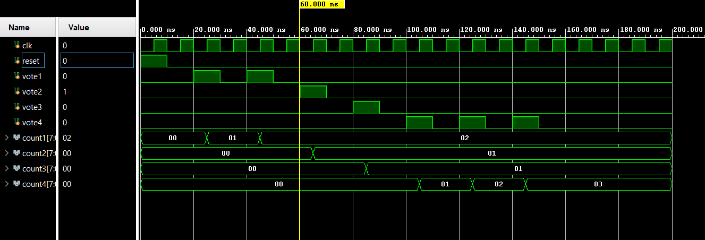

# Electronic Voting Machine (EVM) using Verilog

## Overview

This project implements an **Electronic Voting Machine (EVM)** using **Verilog HDL** and **Xilinx Vivado**. The system allows voting for four candidates and counts votes accurately using synchronous digital logic.

The project was designed, simulated, and verified through waveform analysis in Vivado.

---

## Features

* Supports **4 candidates**
* Individual vote counting mechanism
* Reset functionality
* Clock synchronized operation
* Behavioral simulation using testbench
* Verified waveform output

---

## Technologies Used

* **Verilog HDL**
* **Xilinx Vivado**
* **FPGA Design Flow**
* **Digital Logic Design**

---

## Project Structure

```text
Electronic Voting Machine using Verilog
│── src/
│   └── evm.v
│
├── testbench/
│   └── evm_tb.v
│
├── simulation_results/
│   └── evm_waveform.png
```

---

## Working Principle

The Electronic Voting Machine consists of four voting inputs representing four candidates. Whenever a vote button is pressed, the corresponding vote counter increments on the positive edge of the clock signal.

A reset signal initializes all counters to zero before voting begins.

---

## Simulation Results

The waveform confirms correct operation of the voting system:

* Candidate 1 → 2 votes
* Candidate 2 → 1 vote
* Candidate 3 → 1 vote
* Candidate 4 → 3 votes

  ## Simulation Waveform



---

## Future Improvements

* Password protected admin access
* Prevention of duplicate voting
* LCD/7-segment display integration
* Biometric authentication

---

## Author

**Chirag T**

